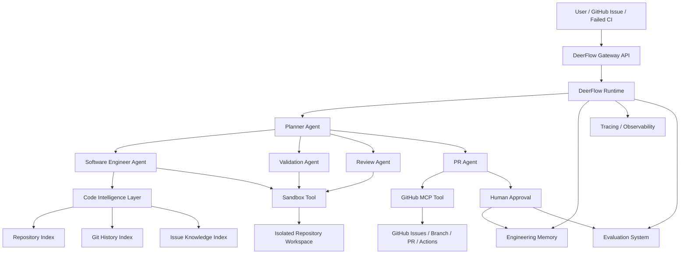

# 初始架构草稿

状态：历史草稿  
类型：早期设计输入  
最后更新：2026-07-09

本文档记录 ForgeFlow 在第一次 Grill-Me 架构评审之前的早期架构设想。

它不是当前权威架构规范。

当前项目方向以后续文档为准：
- `docs/vision.md`
- `docs/milestones.md`
- `docs/development-process.md`
- `docs/project-foundation-proposal.md`
- `rfcs/`

本文档中的部分设计可能已经被后续 RFC 或项目文档收敛、修正或取代。

## 1. 项目名称

**DeerFlow Autonomous Software Engineer Agent**

企业级自动软件工程 Agent，基于 DeerFlow 构建，从 GitHub Issue、错误日志或失败 CI 出发，自动完成代码分析、修复、测试、Review 和 Pull Request 创建。

---

## 2. 项目目标

实现完整研发闭环：

```text
Issue / Failed CI / Error Log
  ↓
Task Analysis
  ↓
Execution Plan
  ↓
Repository Understanding
  ↓
Bug Diagnosis
  ↓
Code Patch
  ↓
Validation
  ↓
Review
  ↓
Pull Request
  ↓
Human Approval
  ↓
Memory / Evaluation Update
```

目标不是替代开发者，而是承担高频、低到中风险的软件维护任务：

- 小型 bug 修复
- 测试失败修复
- 回归问题定位
- 简单重构后的兼容性修复
- 自动补测试
- CI 失败分析

---

## 3. 企业业务场景

**业务角色**

- 软件研发团队
- 平台工程团队
- QA / 测试团队
- DevOps / CI 维护团队

**真实问题**

企业代码库规模大，历史包袱重，bug 修复常常需要开发者花大量时间理解上下文、复现问题、运行测试和等待 CI。很多问题本身并不复杂，但定位链路长，导致维护成本高。

**当前人工流程**

1. 开发者阅读 GitHub Issue / Jira Ticket。
2. 本地拉代码。
3. 搜索相关模块。
4. 根据日志或失败测试定位问题。
5. 修改代码。
6. 运行单测 / 集成测试。
7. 提交 PR。
8. 等待 CI。
9. Reviewer 审查。
10. Merge 或返工。

**Agent 介入方式**

Agent 接收 issue 或 CI failure，自动完成分析、修复、验证和 PR 草稿创建。开发者只需要 review、批准或要求返工。

---

## 4. 架构原则

1. **Agent 负责判断，Tool 负责执行**
   Agent 不直接“假装知道”仓库状态，所有代码、测试、GitHub、CI 信息必须来自工具。

2. **Code Intelligence 是服务，不是 Agent**
   代码索引、符号搜索、历史 issue 检索应稳定、可复现、可缓存。

3. **所有代码修改必须在 Sandbox 内完成**
   不允许 Agent 直接操作生产仓库。

4. **所有高风险动作必须 Human Approval**
   Merge、删除文件、修改生产配置、修改安全策略必须审批。

5. **以 PR 为最终交付物**
   Agent 的最终产出不是一段回答，而是可审查、可测试、可回滚的 PR。

---

## 5. 核心系统架构



---

## 6. Agent 设计

### 6.1 Planner Agent

**职责**

- 理解用户输入。
- 判断任务类型。
- 制定执行计划。
- 调度 Software Engineer、Validation、Review、PR Agent。
- 处理失败和重试。
- 决定是否请求人工介入。

**输入**

- GitHub Issue
- Failed CI log
- Error log
- 用户补充说明

**输出**

结构化计划：

```json
{
  "task_type": "bug_fix | ci_fix | test_fix | refactor_fix",
  "goal": "fix payment rounding error",
  "repo": "payment-service",
  "risk_level": "low | medium | high",
  "steps": [],
  "success_criteria": [],
  "stop_conditions": []
}
```

---

### 6.2 Software Engineer Agent

**职责**

- 理解代码库。
- 定位相关文件。
- 推理根因。
- 生成最小代码修改。
- 输出 PatchProposal。

**不负责**

- 创建 PR。
- 合并代码。
- 无限运行测试。
- 修改高风险文件。

**输出：PatchProposal**

```json
{
  "root_cause": "rounding uses float instead of Decimal",
  "fix_strategy": "replace float arithmetic with Decimal in payment calculation",
  "changed_files": [],
  "risk_level": "medium",
  "test_plan": [],
  "commands_to_validate": [],
  "limitations": []
}
```

---

### 6.3 Validation Agent

**职责**

- 执行测试。
- 分析失败。
- 判断 patch 是否满足 success criteria。
- 最多允许有限轮自动修复。

**策略**

- 先运行最小相关测试。
- 再运行模块级测试。
- 必要时运行全量测试。
- 最多 3 次修复循环。
- 超过限制后转人工。

**输出**

```json
{
  "status": "passed | failed | needs_human",
  "commands": [],
  "test_results": [],
  "failure_analysis": "",
  "retry_count": 0
}
```

---

### 6.4 Review Agent

**职责**

只做阻断级审查：

- 是否解决 issue。
- 是否有明显副作用。
- 是否修改敏感文件。
- 是否引入 secret。
- 是否测试足够。
- 是否需要人工审批。

**输出**

```json
{
  "approved_for_pr": true,
  "risk_level": "low",
  "blocking_issues": [],
  "review_summary": ""
}
```

---

### 6.5 PR Agent

**职责**

- 创建分支。
- 生成 commit。
- 创建 PR。
- 填写 PR 描述。
- 关联 Issue。
- 订阅 CI 状态。
- 将结果回写 DeerFlow thread。

**PR 模板**

```markdown
## Summary

## Root Cause

## Changes

## Validation

## Risk

## Agent Trace

## Related Issue
```

---

## 7. Code Intelligence Layer

Code Intelligence Layer 是确定性检索服务，不属于 Agent。

### 能力

- 文件搜索
- Symbol 搜索
- 函数 / 类定位
- 引用搜索
- Git history 查询
- 类似 issue 查询
- 测试入口推荐
- 模块依赖关系检索

### 数据源

- Repository source code
- Git commits
- GitHub issues
- PR history
- CI logs
- 测试报告

### 输出原则

必须返回证据：

```json
{
  "query": "payment rounding",
  "results": [
    {
      "type": "symbol",
      "file": "src/payment/calculate.py",
      "symbol": "calculate_total",
      "score": 0.91,
      "evidence": "function name and recent commit match"
    }
  ]
}
```

---

## 8. Tool 设计

### 必需工具

| Tool | 能力 |
|---|---|
| GitHub Tool | 读取 issue、创建 branch、commit、PR、查询 CI |
| Sandbox Tool | clone repo、读写文件、执行命令、收集日志 |
| Code Search Tool | 文件、文本、symbol 检索 |
| Git History Tool | commit、diff、blame、历史 PR 查询 |
| Test Tool | 运行测试、解析测试结果 |
| Diff Tool | 生成和解析 diff |
| Secret Scan Tool | 检测 secret 泄露 |
| Static Analysis Tool | 可选，接 Semgrep / ruff / eslint |

### 二期工具

| Tool | 能力 |
|---|---|
| Jira Tool | 查询 ticket、更新状态 |
| CI Tool | 重跑 pipeline、查询失败日志 |
| Slack / IM Tool | 请求人工审批、发送结果通知 |

---

## 9. Middleware 设计

### 必需 Middleware

| Middleware | 职责 |
|---|---|
| Permission Middleware | 控制 repo、branch、文件修改权限 |
| Security Middleware | 阻断 secret、危险命令、敏感文件修改 |
| Cost Control Middleware | 限制 token、step、tool call、运行时间 |
| Human Approval Middleware | 高风险动作审批 |
| Trace Middleware | 统一记录 agent、LLM、tool、memory、test span |
| Patch Boundary Middleware | 限制 patch 范围，避免无关大改 |

### 高风险操作

必须人工审批：

- merge PR
- 删除文件
- 修改 `.github/workflows`
- 修改部署配置
- 修改权限 / auth / crypto 代码
- 修改生产配置
- 大规模重构
- 超过文件数或 diff 行数阈值

---

## 10. State 设计

建议新增 `SoftwareEngineeringState`，作为 DeerFlow ThreadState 的业务扩展数据。

```json
{
  "task": {
    "source": "github_issue",
    "issue_url": "",
    "repo": "",
    "branch": "",
    "task_type": "",
    "success_criteria": []
  },
  "plan": {
    "steps": [],
    "current_step": "",
    "risk_level": ""
  },
  "context": {
    "relevant_files": [],
    "symbols": [],
    "related_commits": [],
    "related_issues": []
  },
  "patch": {
    "changed_files": [],
    "diff_summary": "",
    "root_cause": "",
    "fix_strategy": ""
  },
  "validation": {
    "commands": [],
    "results": [],
    "status": "",
    "retry_count": 0
  },
  "review": {
    "approved_for_pr": false,
    "blocking_issues": [],
    "risk_level": ""
  },
  "pr": {
    "url": "",
    "status": "",
    "ci_status": ""
  }
}
```

---

## 11. Memory 设计

### 不保存

- 源代码全文
- secret
- 临时日志
- 未验证的推理结论
- 大段 diff

### 保存

**Repository Memory**

```yaml
repo: payment-service
test_commands:
  unit: pytest tests/payment
  lint: ruff check .
architecture:
  - Controller -> Service -> Repository
important_paths:
  - src/payment
  - tests/payment
```

**Engineering Memory**

```yaml
conventions:
  - use Decimal for money calculation
  - all payment bug fixes require regression tests
common_failures:
  - timezone mismatch in invoice tests
fix_patterns:
  - rounding bug -> add boundary tests for 0.01, 0.005, large amount
```

### Memory 写入时机

只在以下事件后写入：

- PR 被人工接受。
- CI 通过。
- Reviewer 标记修复有效。
- 用户显式反馈该经验可复用。

---

## 12. Observability 设计

### Trace Pipeline

```text
Agent Request
  ↓
Trace ID
  ↓
Planner Span
  ↓
Repository Context Span
  ↓
LLM Call Span
  ↓
Tool Call Span
  ↓
Sandbox Execution Span
  ↓
Validation Span
  ↓
Review Span
  ↓
PR Creation Span
  ↓
Evaluation Span
  ↓
Final Result
```

### 每次运行记录

- 用户输入
- task type
- plan 版本
- Agent step
- LLM prompt / response
- token
- latency
- tool name
- tool args
- tool result
- 文件修改
- git diff
- 测试命令
- 测试结果
- retry 次数
- middleware 决策
- memory read/write
- PR URL
- CI 状态
- human feedback

### 推荐技术栈

- OpenTelemetry：统一 span。
- Langfuse 或 Phoenix：LLM trace、prompt、eval。
- LiteLLM：模型调用成本、fallback、限流。
- Postgres：业务 run、patch、review、evaluation 记录。
- Grafana：运行指标 dashboard。

---

## 13. Evaluation 设计

### Offline Evaluation

**Benchmark**

- SWE-bench
- SWE-bench Verified
- 企业历史 bug dataset

**指标**

| 类型 | 指标 |
|---|---|
| Agent 能力 | Task Success Rate、Resolved Issue Rate |
| 测试能力 | Test Pass Rate、Regression Test Pass Rate |
| 工程能力 | PR Acceptance Rate、Patch Size、Changed Files |
| 成本 | Token Cost、Execution Time、Tool Calls |
| 稳定性 | Retry Count、Failure Rate、Timeout Rate |

### Online Evaluation

上线后持续追踪：

- PR 被接受比例
- 人工修改 Agent PR 的比例
- CI 通过率
- 平均修复时间
- 开发者节省时间
- 回滚率
- 生产缺陷复发率

### 企业测试集构造

从历史数据中抽样：

1. 已关闭 bug issue。
2. 对应修复 PR。
3. CI 通过记录。
4. 关联测试。
5. 人工标注 root cause 和 expected files。

每条样本包含：

```json
{
  "issue": "",
  "repo_snapshot": "",
  "expected_patch": "",
  "expected_tests": [],
  "acceptance_criteria": []
}
```

---

## 14. 最小可行版本 MVP

为了保证架构简洁，建议 MVP 只做这条闭环：

```text
GitHub Issue
  ↓
Clone repo in sandbox
  ↓
Analyze relevant files
  ↓
Generate patch
  ↓
Run tests
  ↓
Review risk
  ↓
Create draft PR
```

### MVP 包含

- GitHub Issue 输入
- GitHub PR 输出
- Sandbox 执行
- Code Search
- Git diff
- Test runner
- Secret scan
- Trace
- 基础 evaluation

### MVP 暂不包含

- Jira
- Slack 审批
- 多代码库联动
- 自动 merge
- 自动部署
- 复杂组织权限系统
- 大规模知识图谱
- IDE 插件

这些都可以二期再做。

---

## 15. 推荐落地里程碑

### Phase 1：单仓库自动修复 MVP

- 支持 GitHub Issue。
- 支持 clone、search、edit、test、PR。
- 支持 trace。
- 支持人工审批。

### Phase 2：企业治理

- Permission Middleware。
- Security Middleware。
- Cost Control。
- Patch Boundary。
- PR risk report。

### Phase 3：Code Intelligence

- Symbol index。
- Git history retrieval。
- Similar issue retrieval。
- Test command recommendation。

### Phase 4：Evaluation System

- SWE-bench runner。
- 企业 bug dataset。
- Offline eval dashboard。
- Online PR acceptance tracking。

### Phase 5：多系统集成

- Jira。
- GitHub Actions 深度集成。
- Slack / IM approval。
- 多 repo 支持。

---

## 16. 最终判断

你的设计已经具备企业级 Agent 项目的核心骨架。最值得优化的是三个点：

1. **收敛 Agent 数量**
   保留 Planner、Software Engineer、Validation、Review、PR 五类即可。

2. **强化结构化状态**
   用 `PatchProposal`、`ValidationResult`、`ReviewResult` 这些 contract 串起流程，比增加更多 Agent 更重要。

3. **先做 GitHub Issue → Draft PR 的闭环**
   这是最能展示 DeerFlow 工程能力、最容易被面试官和企业理解、也最方便做 SWE-bench evaluation 的路径。

最终项目应定位为：

> 一个可观测、可评估、可治理的企业级自动软件维护 Agent，而不是一个泛化代码助手。